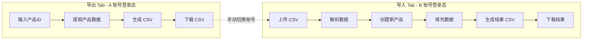
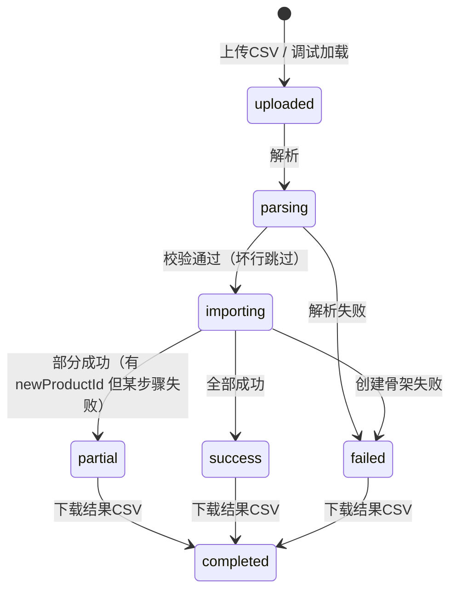

# 携程私家团产品导出/导入工具

## 需求概述

在现有 Chrome 扩展中新增**产品导出/导入**功能，分为两个独立 Tab：

- **导出 Tab**：输入产品 ID 列表 → 提取数据 → 下载 CSV
- **导入 Tab**：上传 CSV → 创建新产品 → 下载结果 CSV

**前提假设**：用户已登录当前账号（无需在插件中处理登录）

**导出范围**：所有 Tab 页数据全部导出

- 销售控制（完整数据）
- 产品信息
- 产品图文
- 行程描述
- 套餐管理
- 价格库存班期
- 资源配置
- 条款维护
- 线路及交通
- 高级设置

**导入时处理**：

- 默认使用：产品类型、产品形态、产品信息、产品图文、行程描述、套餐管理、价格库存班期、条款维护
- 默认跳过（使用目标账号配置）：合同、分销渠道、资源配置、联系人、线路及交通、高级设置
- 可选配置：用户可在导入时选择是否使用某些字段

## 实现状态（当前逻辑）


| 模块      | 状态  | 说明                                                                                                 |
| ------- | --- | -------------------------------------------------------------------------------------------------- |
| 入口      | ✅   | 点击「跨账号复制」打开 Modal，标题「产品跨账号复制」                                                                      |
| 导出 Tab  | ✅   | 输入产品 ID → sequential 提取 → 下载 CSV                                                                   |
| 导入 Tab  | ✅   | 上传 CSV → 解析校验 → sequential 创建 → 下载结果 CSV                                                           |
| 调试模式    | ✅   | URL 含 `?debug=1` 或 `?importDebug=1` 时默认打开导入 Tab，可加载 `DEBUG_IMPORT_FILE_URL` 或内置 `DEBUG_SAMPLE_CSV` |
| 协议校验    | ✅   | schemaVersion=v1、payloadChecksum、Base64 解码                                                         |
| 坏行处理    | ✅   | 宽松模式：跳过坏行继续，错误信息展示前 3 条                                                                            |
| 幂等/断点续跑 | ❌   | 未实现                                                                                                |
| 重试/熔断   | ❌   | 未实现，仅顺序执行                                                                                          |


## 用户界面设计

```
┌─────────────────────────────────────────────────────────────┐
│  产品跨账号复制                                              │
├─────────────────────────────────────────────────────────────┤
│  ┌─────────┐ ┌─────────┐                                    │
│  │  导出   │ │  导入   │                                    │
│  └─────────┘ └─────────┘                                    │
├─────────────────────────────────────────────────────────────┤
│                                                              │
│  【导出 Tab】                                                │
│                                                              │
│  产品 ID（多个用逗号或换行分隔）:                             │
│  ┌────────────────────────────────────────────────────┐     │
│  │ 69245637                                           │     │
│  │ 69245638                                           │     │
│  │ 69245639                                           │     │
│  └────────────────────────────────────────────────────┘     │
│                                                              │
│  [开始导出]                                                  │
│                                                              │
│  ▸ 导出进度                                                  │
│  ┌────────────────────────────────────────────────────┐     │
│  │ 产品ID     │ 产品名称        │ 状态              │     │
│  │ 69245637  │ 嘉兴6日私家团    │ ✅ 完成           │     │
│  │ 69245638  │ 苏州5日私家团    │ 🔄 提取中...      │     │
│  │ 69245639  │ --              │ ⏸ 等待            │     │
│  └────────────────────────────────────────────────────┘     │
│                                                              │
│  [下载 CSV]  （导出完成后可用）                               │
│                                                              │
└─────────────────────────────────────────────────────────────┘

┌─────────────────────────────────────────────────────────────┐
│  【导入 Tab】                                                │
│                                                              │
│  ┌────────────────────────────────────────────────────┐     │
│  │     📁 点击上传或拖拽 CSV 文件到此处                 │     │
│  └────────────────────────────────────────────────────┘     │
│                                                              │
│  [开始导入]                                                  │
│                                                              │
│  ▸ 导入进度                                                  │
│  ┌────────────────────────────────────────────────────┐     │
│  │ 源产品ID   │ 产品名称        │ 新产品ID  │ 状态    │     │
│  │ 69245637  │ 嘉兴6日私家团    │ 71234567 │ ✅ 完成 │     │
│  │ 69245638  │ 苏州5日私家团    │ 71234568 │ ✅ 完成 │     │
│  │ 69245639  │ 杭州4日私家团    │ --       │ ❌ 失败 │     │
│  └────────────────────────────────────────────────────┘     │
│                                                              │
│  [下载结果 CSV]  （导入完成后可用）                           │
│                                                              │
└─────────────────────────────────────────────────────────────┘
```

## 技术架构

### 整体流程




### 导入状态机（当前实现）




### CSV 数据结构

**产品数据 CSV（products_export_20260221.csv）**：


| 字段               | 说明                        |
| ---------------- | ------------------------- |
| schemaVersion    | 协议版本（如 v1）                |
| toolVersion      | 插件版本（用于兼容判断）              |
| exportAccountId  | 导出账号标识（脱敏）                |
| productId        | 源产品 ID                    |
| productName      | 产品名称                      |
| saleControl      | 销售控制-完整数据（JSON Base64 编码） |
| baseInfo         | 产品基础信息（JSON Base64 编码）    |
| imageText        | 产品图文（JSON Base64 编码）      |
| tripDesc         | 行程描述（JSON Base64 编码）      |
| packages         | 套餐管理（JSON Base64 编码）      |
| priceInventory   | 价格库存班期（JSON Base64 编码）    |
| resourceConfig   | 资源配置（JSON Base64 编码）      |
| clauses          | 条款维护（JSON Base64 编码）      |
| routeTraffic     | 线路及交通（JSON Base64 编码）     |
| advancedSettings | 高级设置（JSON Base64 编码）      |
| payloadChecksum  | 行级校验值（sha256）             |
| exportedAt       | 导出时间                      |


**导入结果 CSV（import_result_20260221.csv）**：


| 字段              | 说明                                                                                                                                  |
| --------------- | ----------------------------------------------------------------------------------------------------------------------------------- |
| sourceProductId | 源产品 ID                                                                                                                              |
| productName     | 产品名称                                                                                                                                |
| newProductId    | 新创建的产品 ID                                                                                                                           |
| status          | success / partial / failed                                                                                                          |
| stage           | createProduct / saveBase / saveRichText / saveTrip / savePackage / savePriceInventory / saveResourceConfig / saveClause / completed |
| retryCount      | 重试次数                                                                                                                                |
| errorMessage    | 错误信息（如有）                                                                                                                            |
| importedAt      | 导入时间                                                                                                                                |


### 协议兼容与校验规则（当前实现）

1. 仅支持 `schemaVersion=v1`，不匹配时该行跳过并记录错误。
2. 解析时逐行校验：
  - `payloadChecksum` 校验（10 个 JSON 字段拼接 `|` 后 sha256）
  - Base64 解码、JSON 解析
  - 必填字段：`productId`、`baseInfo`
3. 坏行处理：**宽松模式**，跳过坏行继续，错误信息展示前 3 条 message。
4. 预检报告：未单独导出，错误通过 message.error 提示。

### 核心代码结构

```
contents/createProduct/components/ProductTransfer/
├── index.tsx              # 主组件（Tab 切换）
├── ExportTab.tsx          # 导出 Tab
├── ImportTab.tsx          # 导入 Tab
├── types.ts               # 类型定义
├── utils/
│   ├── csvExport.ts       # CSV 导出工具
│   ├── csvImport.ts       # CSV 解析工具
│   └── base64.ts          # Base64 编解码
└── apis/
    ├── extractProduct.ts  # 提取产品数据（整合现有 API）
    └── createProduct.ts   # 创建产品（复用现有 API）
```

### 关键实现点（当前逻辑）

1. **数据提取（导出）** - `extractProduct.ts`
  - `getProductDetail` → saleControl、baseInfo、advancedSettings
  - `getProductImageText` → imageText
  - `getTourDaily` → tripDesc（tourInfo + tourDaily）
  - `getPackageList` → packages
  - `getBatchOperateSchedule` 循环 24 月 → priceInventory（dates + resourceIds）
  - `getSegments` → resourceConfig（segments）
  - `listProductClauses`（tabEnum 1~4）→ clauses
  - `extractRouteTraffic` 返回空对象（线路及交通跨账号跳过）
  - 请求间隔：`300 + random(500)` ms
2. **CSV 格式** - `csvExport.ts` / `csvImport.ts`
  - JSON 字段 Base64 编码，payloadChecksum = sha256(10 字段 `|` 拼接)
  - 使用 xlsx 库读写，文件名 `products_export_YYYYMMDD_HHmm.csv` / `import_result_*.csv`
3. **数据创建（导入）** - `createProduct.ts`
  - **创建骨架**：`saveSaleControlInfo(productId="", data)`，通过 `getAccountConf()` 使用当前账号 `vendorId`、`saleControlInfoDto`（合同、品牌等）
  - **saveBase**：`saveProductBaseInfo`，合并 baseInfo + saleControl
  - **saveRichText**：`saveDescriptionInfo`，**stripImagesFromProductDesc** 剔除 `` 标签（跨账号图片 ID 不可用）
  - **saveTrip**：`saveTourDailyDetail`，写入 tourDailyDescriptions
  - **savePackage**：合并 curPkg 与 importedPkg，保留新产品 resourceId
  - **savePriceInventory**：按 cost 分组，`savePriceInventoryFetch` 批量写入（每批 ≤300 天）
  - **saveResourceConfig**：复制 segments（stripAdditionalResources 剔除 segmentResourceGroups），createProductDraft → saveSegment → submitSegments
  - **saveClause**：`saveClausesFromData` 或 `saveClauses`
  - 非关键步骤失败时 catch 并 continue，最终 status 为 partial
  - 请求间隔：`500 + random(500)` ms
4. **进度展示**
  - 导出/导入 Table 实时更新 status、stage、errorMessage
  - 新产品 ID 可点击跳转 vbooking 编辑页
  - 完成后启用「下载 CSV」/「下载结果 CSV」
5. **幂等与断点续跑** - 未实现（计划：幂等键 sourceProductId+payloadChecksum、任务持久化、仅重试失败项）
6. **限流与重试** - 当前仅顺序执行，无并发、无重试、无熔断（计划：429 指数退避、单产品超时、熔断阈值）

### 数据字段处理


| 源数据      | 导出  | 导入时处理                                      |
| -------- | --- | ------------------------------------------ |
| 产品类型     | ✅   | 默认使用                                       |
| 产品形态     | ✅   | 默认使用                                       |
| 合同/分销渠道  | ✅   | 默认跳过，使用当前账号配置（可选启用）                        |
| 产品名称/副标题 | ✅   | 默认使用                                       |
| 景区/城市    | ✅   | 默认使用                                       |
| 行程天数/钻级  | ✅   | 默认使用                                       |
| 图片 ID    | ✅   | 默认使用（需验证跨账号可用性）                            |
| 联系人信息    | ✅   | 默认跳过，使用当前账号默认联系人（可选启用）                     |
| 行程描述     | ✅   | 默认使用                                       |
| 套餐管理     | ✅   | 默认使用，资源 ID 等字段根据目标账号调整                     |
| 价格库存班期   | ✅   | 默认使用                                       |
| 资源配置     | ✅   | 默认使用（复制 segments，剔除 segmentResourceGroups） |
| 条款维护     | ✅   | 默认使用                                       |
| 线路及交通    | ✅   | 默认跳过，使用当前账号配置（可选启用）                        |
| 高级设置     | ✅   | 默认跳过，使用当前账号配置（可选启用）                        |


### 失败分级与降级策略


| 场景                         | 处理策略              | 最终状态    |
| -------------------------- | ----------------- | ------- |
| 协议不兼容 / CSV 损坏             | 阻止导入              | failed  |
| 创建骨架失败（`productDuplicate`） | 重试后仍失败则终止该行       | failed  |
| 基础信息保存失败                   | 重试后仍失败则终止该行       | failed  |
| 图文保存失败                     | 记录错误，继续后续步骤       | partial |
| 行程保存失败                     | 记录错误，继续后续步骤       | partial |
| 套餐保存失败                     | 记录错误，继续后续步骤       | partial |
| 价格库存班期保存失败                 | 记录错误，继续后续步骤       | partial |
| 条款保存失败                     | 记录错误              | partial |
| 图片/资源跨账号不可用                | 清空该字段或降级默认值，并记录告警 | partial |


### 使用流程

1. **A 账号导出**
  - 登录 A 账号
  - 打开扩展 → 产品迁移工具 → 导出 Tab
  - 输入要导出的产品 ID
  - 点击"开始导出"
  - 下载 CSV 文件
2. **B 账号导入**
  - 登出 A 账号，登录 B 账号
  - 打开扩展 → 产品迁移工具 → 导入 Tab
  - 上传 CSV 文件
  - 点击"开始导入"
  - 下载结果 CSV（包含新产品 ID）

### 验收标准（DoD）

1. 功能正确性
  - 单产品迁移成功率 >= 95%（非跨账号资源限制场景）
  - 批量 10 个产品可稳定完成，不出现 UI 卡死
2. 可靠性
  - 断网/刷新后可恢复任务，且不重复创建已成功产品
  - 导入重复执行同一 CSV，不产生重复新产品（幂等生效）
3. 可观测性
  - 每个产品均有明确 `status/stage/errorMessage/retryCount`
  - 支持下载导入结果 CSV 和预检报告
4. 兼容性
  - 非 `schemaVersion=v1` 的 CSV 被明确拦截并提示

### 风险与注意事项

- **图片资源**：图片 ID 可能是供应商私有的，跨账号需测试；失败时需降级并标记 `partial`
- **联系人**：自动使用当前账号的默认联系人
- **合同**：自动使用当前账号的默认合同
- **审核状态**：新产品创建后为草稿状态，需手动提交审核
- **批量限制**：建议单次不超过 10 个产品，默认并发 1，启用退避重试避免风控
- **接口漂移**：依赖页面接口可能变更，需保留协议版本与字段映射层

